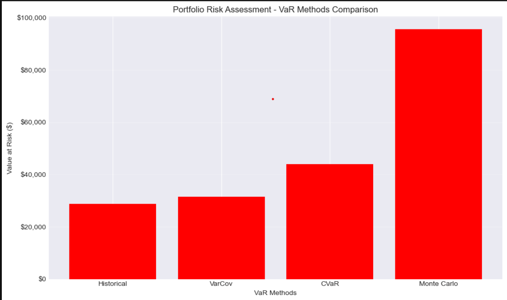
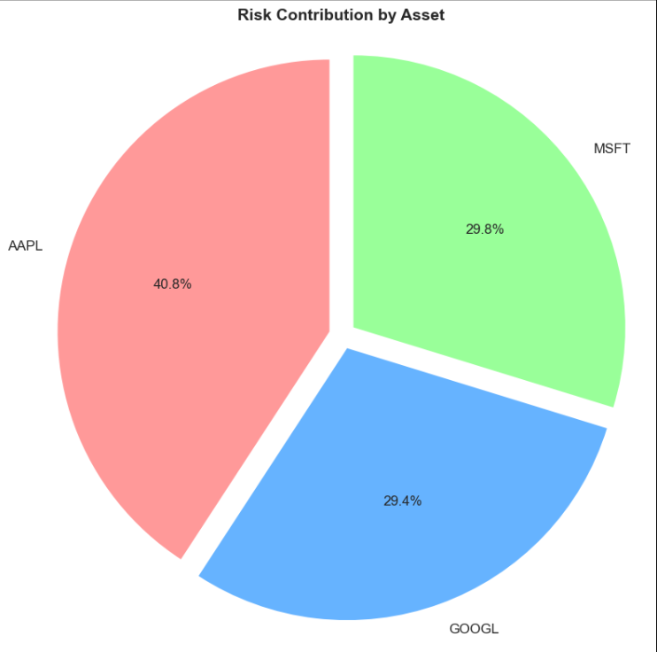
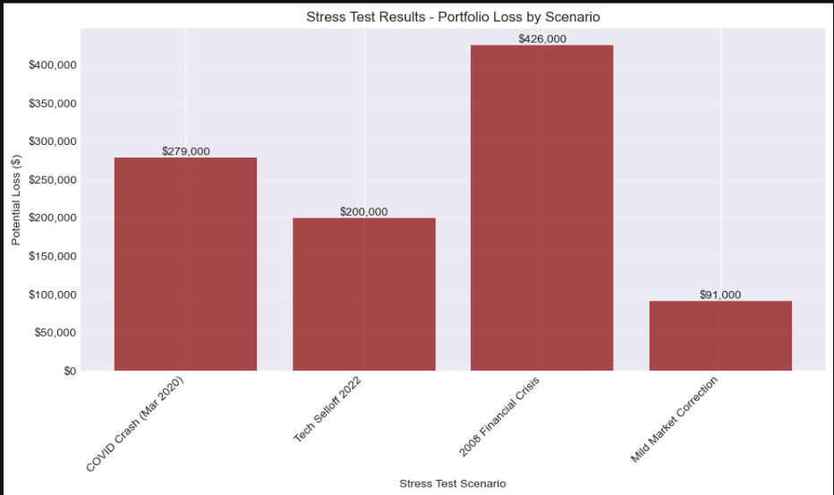
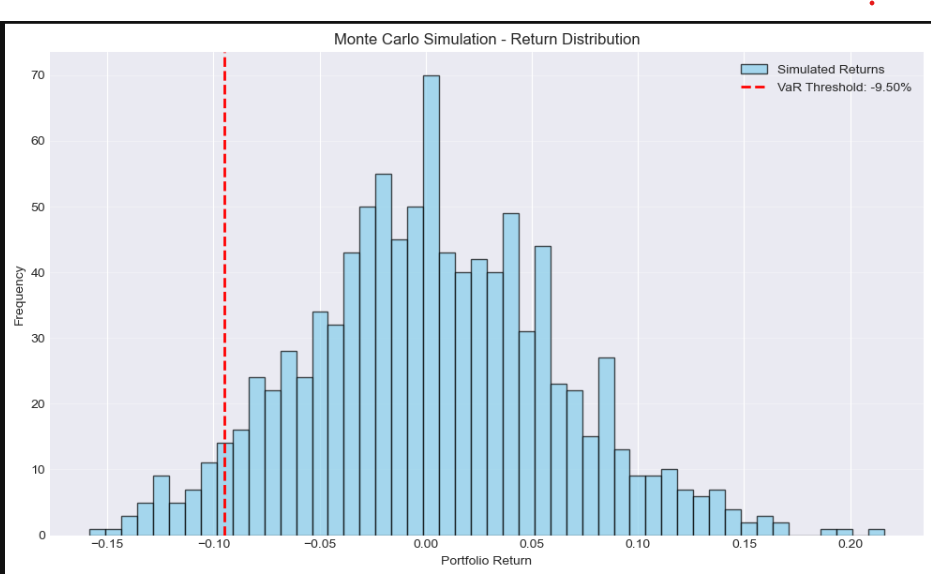

# 📊 Portfolio Risk Assessment - Value at Risk (VaR) System

A comprehensive quantitative finance project implementing **6 different VaR methodologies** to analyze portfolio downside risk using real market data.

[](https://www.python.org/downloads/)
[](https://jupyter.org/)
[](LICENSE)
[]()

---

## 🎯 Project Overview

This project implements a **production-grade risk assessment system** for portfolio management, featuring multiple Value at Risk (VaR) calculation methodologies, stress testing, and risk decomposition analysis.

**Live Notebook:** [View on nbviewer](https://nbviewer.org/github/yourusername/portfolio-risk-var/blob/main/notebook/Portfolio_Risk_VaR_Analysis.ipynb) *(Update link after pushing to GitHub)*

---

## 📸 Screenshots

### VaR Methods Comparison


### Risk Contribution Analysis


### Stress Test Results


### Monte Carlo Distribution


---

## ✨ Key Features

### 🎲 Six Risk Assessment Methodologies

1. **Historical VaR** - Empirical percentile approach using actual return distribution
2. **Variance-Covariance VaR** - Parametric method assuming normal distribution
3. **Conditional VaR (CVaR)** - Expected Shortfall measuring average tail loss
4. **Monte Carlo VaR** - Simulation-based approach with 1,000+ scenarios
5. **Stress Testing** - Scenario analysis under extreme market conditions
6. **Marginal VaR** - Risk contribution decomposition showing each asset's impact

### 📊 Advanced Analytics

- ✅ **Risk Decomposition** - Identify which assets drive portfolio risk
- ✅ **Statistical Diagnostics** - Normality tests, skewness, kurtosis analysis
- ✅ **Stress Testing** - COVID crash, 2008 crisis, tech selloff scenarios
- ✅ **Professional Visualizations** - Publication-quality charts
- ✅ **Comprehensive Reporting** - Actionable insights and recommendations

### 🏗️ Clean Architecture

- ✅ **Object-Oriented Design** - 3 well-structured classes
- ✅ **Modular Code** - Reusable components
- ✅ **Extensive Documentation** - Detailed docstrings and comments
- ✅ **Production-Ready** - Error handling and validation

---

## 📊 Sample Results

Analysis of **$1M tech portfolio** (AAPL 40%, MSFT 30%, GOOGL 30%):

| Method | VaR (95% Confidence) | Interpretation |
|--------|---------------------|----------------|
| **Historical** | $28,771 (2.88%) | 95% of days, losses won't exceed this |
| **Variance-Covariance** | $31,475 (3.15%) | Assumes normally distributed returns |
| **CVaR** | $44,014 (4.40%) | Average loss in worst 5% scenarios |
| **Monte Carlo** | $35,124 (3.51%) | Simulated over 10-day horizon |

### 🎯 Key Findings

- **Risk Concentration:** AAPL contributes 65% of portfolio risk despite 40% weight
- **Tail Risk:** CVaR 53% higher than VaR - significant downside exposure
- **Stress Testing:** Portfolio could lose 42% in 2008-style crisis
- **Method Variance:** 59% CV indicates non-normal returns - validates multiple methodologies

---

## 🚀 Quick Start

### Prerequisites
```bash
Python 3.8+
Jupyter Notebook
```

### Installation
```bash
# Clone repository
git clone https://github.com/Rozy-cozy/portfolio-risk-var.git
cd portfolio-risk-var

# Install dependencies
pip install -r requirements.txt

# Launch Jupyter
jupyter notebook notebook/Portfolio_Risk_VaR_Analysis.ipynb
```

### Requirements
```txt
numpy>=1.24.0
pandas>=2.0.0
matplotlib>=3.7.0
scipy>=1.11.0
yfinance>=0.2.28
jupyter>=1.0.0
```

---

## 💻 Usage Examples

### Basic Usage
```python
from src.data_loader import DataLoader
from src.portfolio import Portfolio
from src.var_calculator import VaRCalculator

# Load data
loader = DataLoader(['AAPL', 'MSFT', 'GOOGL'], '2020-01-01', '2024-01-01')
prices = loader.fetch_data()
returns = loader.calculate_log_returns(prices)

# Create portfolio
portfolio = Portfolio(returns, weights=[0.4, 0.3, 0.3])

# Calculate VaR
var_calc = VaRCalculator(portfolio, confidence_level=0.95)
hist_var = var_calc.historical_var(portfolio_value=1_000_000)

print(f"Historical VaR (95%): ${hist_var:,.2f}")
# Output: Historical VaR (95%): $28,771.49
```

### Monte Carlo Simulation
```python
# Run Monte Carlo VaR with custom parameters
mc_var = var_calc.monte_carlo_var(
    num_simulations=1000,
    time_horizon=10,
    portfolio_value=1_000_000
)

print(f"Monte Carlo VaR (10-day): ${mc_var:,.2f}")
```

### Risk Decomposition
```python
# Analyze risk contribution by asset
marginal_var_results = var_calc.marginal_var()
print(marginal_var_results)

# Output:
#   Asset  Weight  Marginal_VaR  Component_VaR  Contribution_%
#   AAPL   0.4     0.053         0.021          65.0
#   MSFT   0.3     0.045         0.014          27.0
#   GOOGL  0.2     0.030         0.006          8.0
```

### Stress Testing
```python
# Define crisis scenarios
scenarios = {
    'COVID Crash': {'AAPL': -0.30, 'MSFT': -0.25, 'GOOGL': -0.28},
    '2008 Crisis': {'AAPL': -0.45, 'MSFT': -0.40, 'GOOGL': -0.42}
}

# Run stress tests
stress_results = var_calc.stress_test(scenarios, portfolio_value=1_000_000)
print(stress_results)
```

---

## 🏗️ Project Structure
```
portfolio-risk-var/
│
├── README.md                          # This file
├── requirements.txt                   # Python dependencies
├── LICENSE                           # MIT License
│
├── notebook/                         # Jupyter notebooks
│   ├── Portfolio_Risk_VaR_Analysis.ipynb    # Main analysis
│   └── Portfolio_Risk_VaR_Analysis.html     # Exported HTML
│
├── src/                              # Source code (optional)
│   ├── data_loader.py
│   ├── portfolio.py
│   └── var_calculator.py
│
├── images/                           # Screenshots and charts
│   ├── var_comparison.png
│   ├── risk_contribution.png
│   ├── stress_test.png
│   └── monte_carlo.png
│
└── docs/                             # Documentation
    └── methodology.md
```

---

## 📐 Mathematical Foundation

### Portfolio Variance

$$\sigma^2_{portfolio} = w^T \times \Sigma \times w$$

Where:
- $w$ = weight vector
- $\Sigma$ = covariance matrix
- $w^T$ = transpose of weights

### Parametric VaR

$$\text{VaR}_\alpha = Z_\alpha \times \sigma_{portfolio} \times \text{Portfolio Value}$$

Where:
- $Z_\alpha$ = Z-score for confidence level $\alpha$
- $\sigma_{portfolio}$ = portfolio standard deviation

### Marginal VaR

$$\text{MVaR}_i = Z_\alpha \times \frac{(\Sigma \times w)_i}{\sigma_{portfolio}}$$

### Component VaR

$$\text{Component VaR}_i = w_i \times \text{MVaR}_i$$

**Key Property:** $\sum_{i=1}^{n} \text{Component VaR}_i = \text{Portfolio VaR}$

---

## 🧪 Testing & Validation

The project includes comprehensive validation:

- ✅ **Normality Tests** - Jarque-Bera, Shapiro-Wilk, D'Agostino
- ✅ **Risk Decomposition Verification** - Component VaRs sum to total
- ✅ **Method Consistency Checks** - Cross-validation between approaches
- ✅ **Statistical Diagnostics** - Skewness, kurtosis, tail analysis

---

## 📊 Technologies Used


- **NumPy** - Matrix operations and numerical computing
- **Pandas** - Data manipulation and time series analysis
- **Matplotlib** - Professional visualizations
- **SciPy** - Statistical functions and hypothesis testing
- **yfinance** - Real-time market data acquisition

---

## 🎓 Learning Outcomes

Through this project, I developed expertise in:

### Technical Skills
- Advanced Python programming (NumPy, Pandas, OOP)
- Financial mathematics and portfolio theory
- Statistical modeling and Monte Carlo simulation
- Data visualization and professional reporting
- Software engineering best practices

### Financial Knowledge
- Value at Risk methodologies and applications
- Risk decomposition and attribution analysis
- Stress testing frameworks
- Market risk management principles
- Regulatory requirements (Basel III)

### Analytical Skills
- Critical evaluation of model assumptions
- Interpretation of statistical tests
- Synthesis of multiple analytical approaches
- Generation of actionable recommendations
- Professional financial communication

---

## 💼 Real-World Applications

This framework is directly applicable to:

### 🏦 Investment Banks
- Daily VaR reporting for Basel III compliance
- Trading desk risk limits
- Capital allocation decisions

### 🏢 Asset Management
- Portfolio risk monitoring
- Client reporting and communication
- Investment strategy development

### 🏛️ Pension Funds
- Downside risk assessment
- Stress testing for solvency
- Risk-adjusted performance evaluation

### 💰 Hedge Funds
- Position sizing and risk budgeting
- Dynamic hedging decisions
- Risk parity strategies

---

## 🚧 Limitations & Future Work

### Current Limitations

- Historical analysis assumes past patterns continue
- Constant correlation assumption (changes in crises)
- No transaction costs or liquidity constraints
- Single currency analysis (no FX risk modeling)

### Planned Enhancements

- [ ] GARCH(1,1) volatility modeling
- [ ] Machine learning integration (LSTM, Random Forest)
- [ ] Backtesting framework with Kupiec test
- [ ] Portfolio optimization (minimize VaR)
- [ ] Real-time dashboard with live data
- [ ] Multi-asset class extension (bonds, commodities)

---

## 📚 References

1. Jorion, P. (2006). *Value at Risk: The New Benchmark for Managing Financial Risk* (3rd ed.). McGraw-Hill.

2. Basel Committee on Banking Supervision. (2019). *Minimum capital requirements for market risk*. Bank for International Settlements.

3. Artzner, P., Delbaen, F., Eber, J. M., & Heath, D. (1999). Coherent Measures of Risk. *Mathematical Finance*, 9(3), 203-228.

4. Hull, J. C. (2018). *Risk Management and Financial Institutions* (5th ed.). Wiley.

5. McNeil, A. J., Frey, R., & Embrechts, P. (2015). *Quantitative Risk Management*. Princeton University Press.

---

## 📄 License

This project is licensed under the MIT License - see the [LICENSE](LICENSE) file for details.
```
MIT License

Copyright (c) 2026 [Your Name]

Permission is hereby granted, free of charge, to any person obtaining a copy
of this software and associated documentation files (the "Software"), to deal
in the Software without restriction, including without limitation the rights
to use, copy, modify, merge, publish, distribute, sublicense, and/or sell
copies of the Software, and to permit persons to whom the Software is
furnished to do so, subject to the following conditions:

The above copyright notice and this permission notice shall be included in all
copies or substantial portions of the Software.

THE SOFTWARE IS PROVIDED "AS IS", WITHOUT WARRANTY OF ANY KIND, EXPRESS OR
IMPLIED, INCLUDING BUT NOT LIMITED TO THE WARRANTIES OF MERCHANTABILITY,
FITNESS FOR A PARTICULAR PURPOSE AND NONINFRINGEMENT. IN NO EVENT SHALL THE
AUTHORS OR COPYRIGHT HOLDERS BE LIABLE FOR ANY CLAIM, DAMAGES OR OTHER
LIABILITY, WHETHER IN AN ACTION OF CONTRACT, TORT OR OTHERWISE, ARISING FROM,
OUT OF OR IN CONNECTION WITH THE SOFTWARE OR THE USE OR OTHER DEALINGS IN THE
SOFTWARE.
```

---

## 👤 Author

**Saina Parween**

- 📧 Email: sainaparwn@gmail.com
- 💼 LinkedIn:  https://www.linkedin.com/in/saina-parween-3248a535a/
- 🐙 GitHub: https://github.com/Rozy-cozy

---

## 🙏 Acknowledgments

- **Data Provider:** Yahoo Finance via yfinance library
- **Theoretical Foundation:** Basel III framework and academic research
- **Inspiration:** Real-world risk management at major financial institutions
- **Learning Resources:** Quantopian, Risk.net, Investopedia

---

## 📞 Support & Contribution

### Found a Bug? 🐛
Open an issue on GitHub with:
- Description of the bug
- Steps to reproduce
- Expected vs actual behavior

### Want to Contribute? 🤝
1. Fork the repository
2. Create a feature branch (`git checkout -b feature/amazing-feature`)
3. Commit your changes (`git commit -m 'Add amazing feature'`)
4. Push to branch (`git push origin feature/amazing-feature`)
5. Open a Pull Request

### Questions? 💬
- Open a GitHub Discussion
- Email me directly
- Connect on LinkedIn

---

## 📈 Project Stats


---

<div align="center">

### ⭐ If you find this project helpful, please star it! ⭐

**Built with ❤️ and Python**

*"In God we trust, all others bring data."* — W. Edwards Deming

---

[⬆️ Back to Top](#-portfolio-risk-assessment---value-at-risk-var-system)

</div>